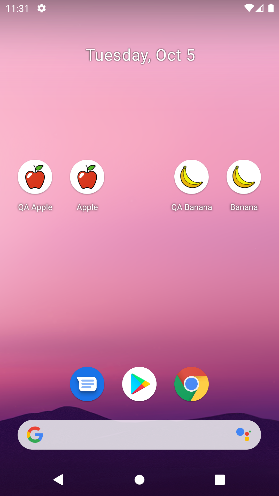

# FruitApp

## The missing guide to React Native app variants

This repository contains example code for my article published on [Medium](https://medium.com/supercharges-mobile-product-guide/the-missing-guide-to-react-native-app-variants-part-1-c036fb99ebcc).

### Android end result


### iOS end result


## How to

### Install dependencies

```sh
# Install JS dependencies
npm install

# Install iOS pod dependencies
cd ios && pod install && cd ..
```

### Running different Android app variants
```sh
# Apple-QA-debug build
npm run run:android:apple:qa

# Apple-Prod-debug build
npm run run:android:apple:prod

# Banana-QA-debug build
npm run run:android:banana:qa

# Banana-Prod-debug build
npm run run:android:banana:prod
```

### Running different iOS app variants
```sh
# Apple-QA-debug build
npm run run:ios:apple:qa

# Apple-Prod-debug build
npm run run:ios:apple:prod

# Banana-QA-debug build
npm run run:ios:banana:qa

# Banana-Prod-debug build
npm run run:ios:banana:prod
```